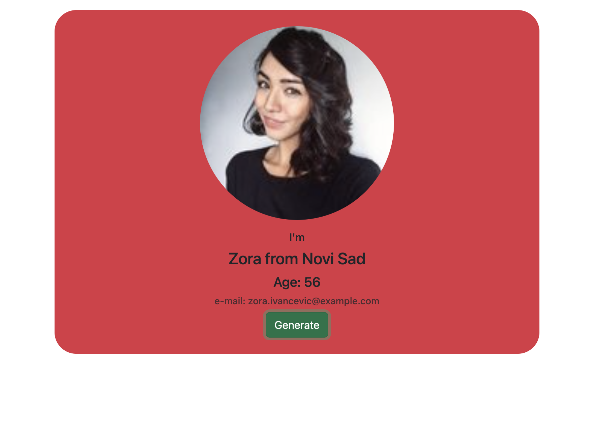

<p>Clarusway</p>

<br>

# Random User Generator App

## Live at: https://random-user-generator-umut.netlify.app


## Description

Project aims to create a Random User Generator App.

## Problem Statement

- We are adding a new project to our portfolios. So you and your colleagues have started to work on the project.

## Project Skeleton

```
Random User Generator App
|
|----readme.md         # Given to the students (Definition of the project)
SOLUTION
├── public
│     └── index.html
├── src
│    ├── App.js
|    |__ Card.jsx
│    ├── index.js
├── package.json
└── yarn.lock
```

## Expected Outcome



## Objective

Build a Random User Generator App using ReactJS.

### At the end of the project, following topics are to be covered;

- HTML

- CSS

- JS

- ReactJS

### At the end of the project, students will be able to;

- improve coding skills within HTML & CSS & JS & ReactJS.

- use git commands (push, pull, commit, add etc.) and Github as Version Control System.

## Notes

- You can add additional functionalities to your app.

**<p align="center">&#9786; Happy Coding &#9997;</p>**
